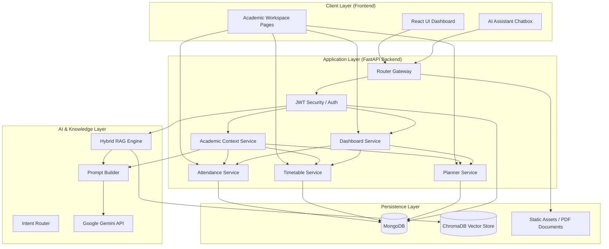
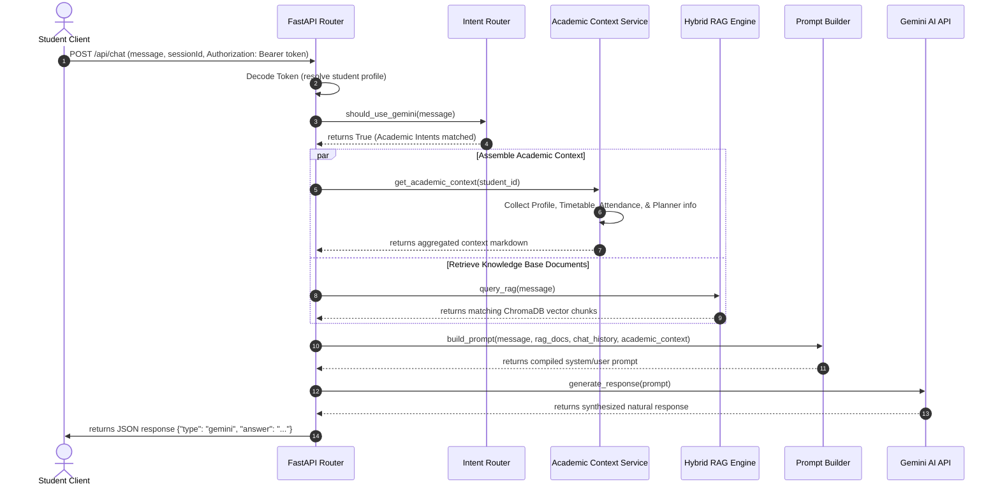
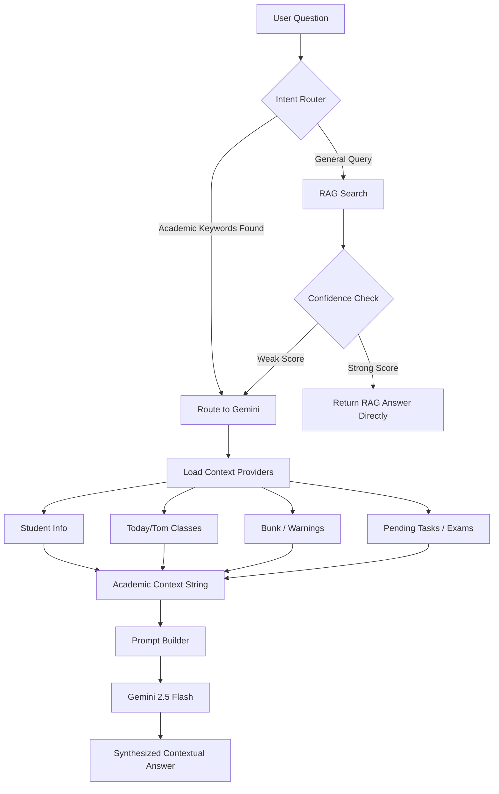
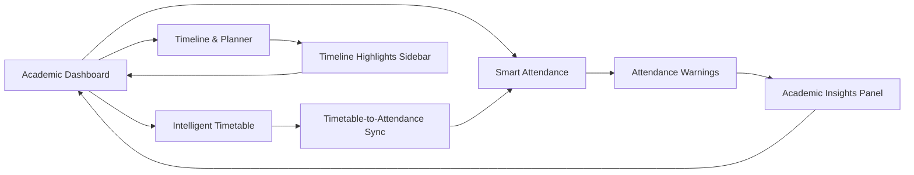

# BIT Mesra AI Agent

[](#)
[](LICENSE)
[](#)
[](#)

BIT Mesra AI Agent is a production-grade, AI-powered digital campus assistant and personalized academic workspace designed for the students of Birla Institute of Technology, Mesra. 

It is no longer just a simple chatbot. It is a complete AI-powered campus workspace that aggregates Hybrid RAG (Retrieval-Augmented Generation), intelligent student schedules, attendance forecasting, customizable planner timeline tracking, interactive campus maps, and enterprise admin document ingestion pipelines into a single unified platform.

---

## Table of Contents
1. [Tech Stack](#tech-stack)
2. [High-Level Architecture](#high-level-architecture)
3. [Project Structure](#project-structure)
4. [Application Flow & Sequence](#application-flow--sequence)
5. [AI Architecture & Context Engine](#ai-architecture--context-engine)
6. [Academic Workspace Modules](#academic-workspace-modules)
7. [Database Schema Overview](#database-schema-overview)
8. [API Documentation Overview](#api-documentation-overview)
9. [Installation & Setup](#installation--setup)
10. [Environment Variables](#environment-variables)
11. [Screenshots](#screenshots)
12. [Roadmap](#roadmap)
13. [Future Improvements](#future-improvements)
14. [Contributing](#contributing)
15. [License](#license)
16. [Acknowledgements](#acknowledgements)

---

## Tech Stack

The application utilizes a decoupled, modern web-app stack:

| Layer | Technologies |
| :--- | :--- |
| **Frontend** | React 18, TypeScript, TailwindCSS, React Router v6, Axios, Framer Motion, Lucide Icons |
| **Backend** | FastAPI, Python 3.13, Pydantic v2, JWT Security, Motor (Async MongoDB Driver) |
| **AI & LLM** | Google Gemini 2.5 Flash, Gemini 1.5 Pro (Vision), LangChain, HuggingFace Transformers |
| **Databases & Vector Stores** | MongoDB, ChromaDB (Vector Indexing), SQLite (Notices cache fallback) |
| **Knowledge Base** | Unstructured PDF Parsing, LangChain Text Splitters, Incremental Sync Crawlers |

---

## High-Level Architecture

The system is designed as a distributed workspace consisting of a responsive client dashboard, an asynchronous REST API, a vector database instance, and modular domain-specific context providers.



---

## Project Structure

```
bit-mesra-ai-agent/
├── backend/
│   ├── app/
│   │   ├── auth/              # JWT token signers, validators, & routes
│   │   ├── context/           # Context providers for Student, Timetable, Attendance, etc.
│   │   ├── core/              # Database connections, config, & setups
│   │   ├── middleware/        # JWT validation interceptors & CORS configs
│   │   ├── models/            # Pydantic validation schemas & db models
│   │   ├── repositories/      # Database CRUD interfaces (Motor driver)
│   │   ├── routes/            # REST API controllers (FASTAPI Routers)
│   │   ├── services/          # Core business services & LLM pipelines
│   │   │   ├── llm/           # Prompt Builder, Gemini Service, & Intent Router
│   │   │   └── rag/           # ChromaDB search, embedding builders, & retriever
│   │   └── utils/             # JSON loaders & timezone datetime helpers
│   ├── data/                  # Embedded static data (academic calendar, maps)
│   ├── scripts/               # Embeddings index builders & data crawlers
│   ├── tests/                 # Pytest backend test suites
│   ├── requirements.txt
│   └── test_chat.py
├── frontend/
│   ├── src/
│   │   ├── app/               # Layout wrappers & context providers
│   │   ├── assets/            # Tailwind theme tokens & global styles
│   │   ├── features/          # Decoupled feature directories
│   │   │   ├── academics/     # Timetable, Attendance, Planner, & Dashboard pages
│   │   │   ├── auth/          # Login, Register, & JWT management
│   │   │   ├── chat/          # AI Chat assistant window & message bubbles
│   │   │   └── map/           # Campus map navigation components
│   │   ├── shared/            # Shared UI components (matte cards, sidebar, skeletons)
│   │   ├── App.tsx            # Routes configuration
│   │   └── main.tsx
│   ├── index.html
│   ├── package.json
│   └── tsconfig.json
└── README.md
```

---

## Application Flow & Sequence

The diagram below represents the complete end-to-end data pipeline when an authenticated student queries the AI assistant about their academic status.



---

## AI Architecture & Context Engine

### 1. Hybrid RAG Pipeline
The Retrieval-Augmented Generation engine indices raw campus files, administrative notifications, and department guides. During retrieval, queries are embedded using HuggingFace models and parsed against ChromaDB indices.

### 2. Academic Context Engine
Instead of requiring students to input their specific department details, current timetable schedules, or bunk margins in every chat turn, the **Academic Context Engine** automatically queries active MongoDB profiles, resolves the local date/time parameters in India Standard Time (IST), aggregates course percentages, and maps them to a formatted context string.

### 3. Intent Detection & Routing
A rule-based keyword router analyzes query parameters. General conversational queries, comparison questions, and all academic-related triggers automatically bypass local RAG retrievals and route directly to Gemini for contextual reasoning.



---

## Academic Workspace Modules

The **Academic Workspace** serves as the digital command center. It is split into five tightly integrated services:



### 1. Academic Dashboard
Aggregates timetable schedules, attendance summaries, pending task highlights, calendar milestones, and quick action redirects. Features a deterministic rule-based insights compiler notifying students of critical workspace items (e.g. low attendance warnings, upcoming papers, or tomorrow's busy periods).

### 2. Intelligent Timetable
Allows manual class configuration alongside a cutting-edge **AI PDF/Image Timetable Import** module. Students can upload their official university timetable scans, and Gemini Vision automatically parses course times, classrooms, building codes, and instructors, converting them to active MongoDB schedules.

### 3. Smart Attendance Tracking
Calculates statistics dynamically from log lists to avoid drifting database counters. Employs:
* **Safe Leaves Calculator**: Computes exactly how many lectures a student can miss (bunk) without falling below the mandatory 75% threshold.
* **Required Classes Recovery**: Computes how many consecutive sessions a student must attend to restore their status to >= 75%.

### 4. Academic Timeline & Planner
Features a vertical Notion-inspired timeline. Automatically compiles:
* Timetable classes scheduled for Today and Tomorrow in IST.
* Static Academic Calendar events (quizzes, registration dates, holidays).
* Active low-attendance alerts.
* Personal checklist planner items (with priorities, categories, due timestamps, and tag support).

---

## Database Schema Overview

The system runs on **MongoDB** utilizing asynchronous repository wrappers. Main collections include:

| Collection Name | Model Object | Purpose | Key Attributes |
| :--- | :--- | :--- | :--- |
| `students` | `StudentModel` | User credentials & credentials profile | `email`, `password_hash`, `role`, `profile` (branch, semester, section) |
| `academic_workspaces` | `AcademicWorkspaceModel` | Basic workspace state configurations | `student_id`, `semester`, `department`, `section`, `initialized` |
| `timetables` | `TimetableModel` | Daily schedules and classroom allocations | `student_id`, `semester`, `classes` (id, subject, faculty, start_time, end_time) |
| `attendance_records` | `AttendanceRecordModel` | Course-wise attendance stats | `student_id`, `subject_id`, `subject_name`, `total_conducted`, `total_attended` |
| `attendance_logs` | `AttendanceLogModel` | Audit history records for logged classes | `attendance_record_id`, `class_date`, `status` (Present, Absent, etc.), `remarks` |
| `planner_tasks` | `PlannerTaskModel` | Checklist items and personal reminders | `student_id`, `title`, `description`, `category`, `priority`, `due_date`, `completed` |
| `sessions` | `SessionModel` | Conversation history threads for AI | `sessionId`, `messages` (role, content, timestamp) |

---

## API Documentation Overview

### 1. Authentication
* `POST /api/auth/register` - Registers a new student.
* `POST /api/auth/login` - Returns JWT access and refresh tokens.
* `POST /api/auth/refresh` - Requests a new access token.

### 2. AI Chat & RAG
* `POST /chat` - Standard AI Assistant chat endpoint (combines RAG, Memory, and Gemini).
* `GET /api/academics/context` - Debug/development endpoint returning the compiled student academic context string.

### 3. Academics Workspace
* `GET /api/academics/workspace` - Retrieves current academic workspace state.
* `POST /api/academics/workspace/initialize` - Initializes workspace (semester, department).
* `GET /api/academics/dashboard` - Unified dashboard query (Today's classes, attendance summaries, exams, planner details, and insights).

### 4. Timetable
* `GET /api/academics/timetable` - Retrieves student timetable.
* `POST /api/academics/timetable/import/pdf` - Parses timetable scanned sheets using Gemini Vision.
* `POST /api/academics/timetable/classes` - Adds a custom class to the schedule.

### 5. Attendance
* `GET /api/attendance` - Lists course attendance percentages and recovery statistics.
* `GET /api/attendance/summary` - Retrieves summary metrics (best subject, needs focus, warnings).
* `POST /api/attendance/log` - Logs a new attendance log entry (Present/Absent/Medical) and recalculates metrics.

### 6. Planner & Tasks
* `GET /api/planner/tasks` - Lists all planner tasks.
* `POST /api/planner/tasks` - Adds a new task.
* `PATCH /api/planner/tasks/{id}/complete` - Toggles task completion.
* `GET /api/planner/timeline` - Compiles the unified chronological timeline stream.

---

## Installation & Setup

### Prerequisites
* **Python 3.13+** installed
* **Node.js 18+** installed
* **MongoDB** running locally or via Atlas connection string
* **ChromaDB** vector store configured
* A **Google Gemini API Key**

### Clone Repository
```bash
git clone https://github.com/Anugrahbhuinya/bit-mesra-ai-agent.git
cd bit-mesra-ai-agent
```

### Backend Setup
1. Navigate to the backend directory:
   ```bash
   cd backend
   ```
2. Create and activate a virtual environment:
   ```bash
   python -m venv venv
   # On Windows:
   venv\Scripts\activate
   # On macOS/Linux:
   source venv/bin/activate
   ```
3. Install dependencies:
   ```bash
   pip install -r requirements.txt
   ```
4. Create a `.env` file from the example configuration:
   ```bash
   cp .env.example .env
   ```
5. Run the FastAPI development server:
   ```bash
   uvicorn app.main:app --reload --port 8000
   ```

### Frontend Setup
1. Open a new terminal and navigate to the frontend directory:
   ```bash
   cd frontend
   ```
2. Install npm packages:
   ```bash
   npm install
   ```
3. Start the Vite local development server:
   ```bash
   npm run dev
   ```

### Production Build
To build the optimized static assets for production deployment:
```bash
cd frontend
npm run build
```

---

## Environment Variables

### Backend (`backend/.env`)
Create a `.env` file in the `backend/` directory using the following template:

```env
# Application Settings
APP_NAME="BIT Mesra AI Agent"
DEBUG=True
PORT=8000

# Security Settings
SECRET_KEY="your-super-secret-jwt-signing-key-here"
ALGORITHM="HS256"
ACCESS_TOKEN_EXPIRE_MINUTES=120

# Databases Setup
MONGODB_URI="mongodb://localhost:27017"
MONGODB_DB_NAME="bit_mesra_ai_agent"
CHROMA_DB_PATH="./chroma_db"

# LLM Integrations
GEMINI_API_KEY="AIzaSyYourGeminiApiKeyHere"
GEMINI_MODEL="gemini-2.5-flash"
```

---

## Screenshots

### Dashboard


### AI Assistant


### Academic Workspace


### Timetable


### Attendance


### Planner


### Campus Map


### Admin Dashboard


---

## Roadmap

* **✅ Phase 1** — Universal Search
* **✅ Phase 2** — Conversation Memory
* **✅ Phase 3** — Hybrid RAG
* **✅ Phase 4** — Gemini AI
* **✅ Phase 5** — Enterprise Admin
* **✅ Phase 6** — Website Knowledge
* **✅ Phase 7** — Student Platform
* **✅ Phase 8** — Academic Workspace Foundation, Schedules, Attendance, & Timeline Contexts
* **🚧 Phase 9** — Intelligent Campus Navigation (Indoor Route mapping & building locators)

---

## Future Improvements

Features currently scheduled in the project roadmap:
* **Indoor Navigation Mapping**: Vector coordinates for locating labs, seminar halls, and lecture halls inside department buildings.
* **AI Route Optimization**: Displays the shortest path between classrooms on consecutive lecture schedules.
* **Context-Aware Travel Reminders**: Warns students to start moving to their next class based on current location coordinates and schedule parameters.
* **Performance Enhancements**: Caching vectors and optimizing embedding retrievals for low latency on mobile client networks.

---

## Contributing

Contributions are welcome! Please follow these guidelines:

1. Fork the repository.
2. Create a feature branch (`git checkout -b feature/AmazingFeature`).
3. Commit your changes using descriptive commit messages (`git commit -m 'feat: add amazing feature'`).
4. Push to the branch (`git push origin feature/AmazingFeature`).
5. Open a Pull Request.

Make sure your changes pass all pytest checks and frontend lint/build verification commands before submitting.

---

## License

This project is licensed under the MIT License - see the [LICENSE](LICENSE) file for details.

---

## Acknowledgements

Special thanks to the open-source community and creators of the main technologies powering this workspace:

* **React** & **TypeScript** - Core frontend framework
* **FastAPI** & **MongoDB** - Asynchronous database and REST handlers
* **Google Gemini** - LLM reasoning & vision parsing
* **LangChain** & **ChromaDB** - Vector indexings and retrieval loaders
* **TailwindCSS** - Style tokens and matte themes
