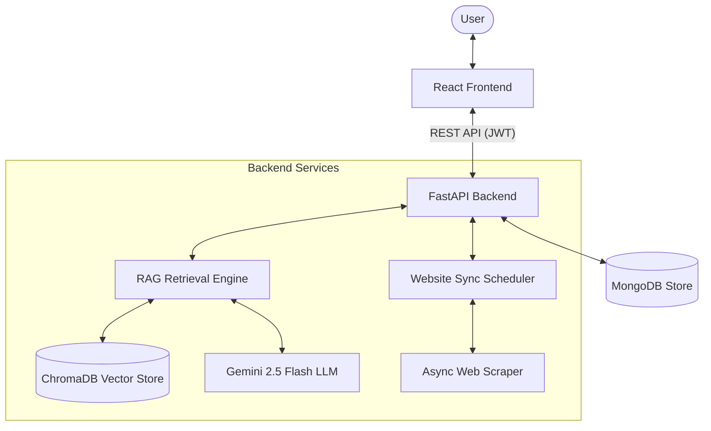
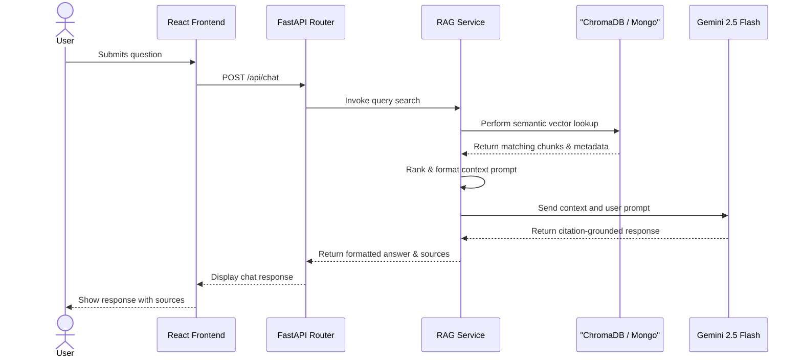
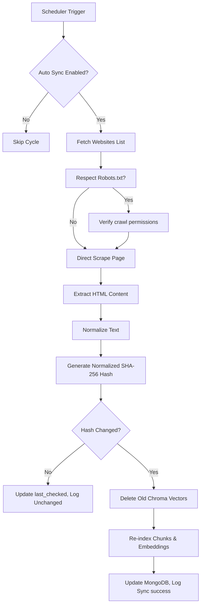

# System Architecture Documentation

This document describes the architectural design and system flow of the **BIT Mesra AI Assistant** (Enterprise Knowledge Platform).

---

## 1. Overview
The **BIT Mesra AI Assistant** is a production-grade, AI-powered digital campus assistant built to assist students, administrators, and visitors. The system provides search, FAQ verification, interactive maps navigation, notice alerts, and chat support with source-grounded answers extracted from dynamic PDF knowledge bases and website pages.

---

## 2. High-Level Architecture

The platform uses a Client-Server separation model with:
- **Frontend Layer:** React web app communicating via REST APIs.
- **Backend Layer:** FastAPI service running async request routers and background worker threads.
- **Retrieval-Augmented Generation (RAG):** Hybrid retriever querying ChromaDB (vector indexing) and MongoDB (relational/metadata) before generating grounded answers using Gemini.



---

## 3. Frontend Architecture

The frontend is a modern SPA designed around Vite, React, TypeScript, and TailwindCSS:
- **Routing:** Handled client-side using `react-router-dom` with guards for admin dashboards.
- **State Management:** Uses lightweight `zustand` stores for admin parameters, authentication tokens, and notification toasts.
- **Directory Layout:** Built using Feature-Driven Development (FDD) where modules are encapsulated by capability under `src/features/`.
- **Key Modules:**
  - **Chat Interface:** Interactive chat widget supporting streaming text, conversation resets, memory histories, and detailed source citations.
  - **Admin Dashboard:** Administrative workspace containing controls for PDF uploading, list logs, website configurations, synchronization stats, and crawler parameters.

---

## 4. Backend Architecture

The backend is built around FastAPI, exploiting Python's modern asynchronous lifecycle capabilities:
- **FastAPI Router:** Dispatches REST queries to respective controller endpoints.
- **Lifespan Manager:** Hooks into FastAPI's startup/shutdown cycles to:
  1. Initialize database configurations and seed default users.
  2. Launch the background synchronization scheduler task.
  3. Close database pools and worker handles on termination.
- **Service-Oriented Architecture (SOA):** Separates controller routers from business logic. Key services include `UniversalSearch`, `RAGService`, `LocationService`, and `WebsiteService`.
- **Dependency Injection:** Resolves configuration properties and database connections on request.

---

## 5. AI Retrieval & Ingestion Pipeline

### 5.1 RAG Retrieval Engine Flow
When a user submits a query:
1. **Intent Detection:** Determines the search mode (FAQ, Location, Website, PDF, or Chat).
2. **Hybrid Retrieval:** Concurrently queries ChromaDB (using semantic vector similarity via `BAAI/bge-small-en-v1.5` embeddings) and MongoDB metadata attributes.
3. **Context Contextualization:** Re-ranks and packages matching text snippets into an instruction context.
4. **LLM Generation:** Sends the grounded context to Gemini 2.5 Flash to synthesize a citation-linked response.



### 5.2 Dynamic PDF Ingestion Pipeline
Processes dynamic PDF documents uploaded through the Admin dashboard:
```
PDF Document → PyPDF Text Extraction → Recursive Split Chunking → HuggingFace Embeddings → ChromaDB Vector Store
```

### 5.3 Website Ingestion Pipeline
Crawls, parses, normalizes, and embeds public webpages:
```
Target URL → Web Crawler → BeautifulSoup Extractor → Content Normalizer → Embedding Generation → ChromaDB Store
                                                                \
                                                                 → MongoDB Metadata
```

---

## 6. Automatic Website Synchronization

The synchronization module schedules and executes incremental crawling cycles to keep the indexed knowledge base aligned with active webpages.



- **Intelligent Change Detection:** Uses a normalizer utility ([content_normalizer.py](file:///c:/Users/ASUS/bit-mesra-ai-agent/backend/app/services/websites/content_normalizer.py)) to strip out volatile/dynamic page properties (date formats, timestamps, visitor hits counters, tokens, UUIDs, extra whitespaces) before hashing. This ensures content updates only trigger a vector reload when *meaningful* text modifications are detected.

---

## 7. Database Design

### 7.1 MongoDB Collections
- **`websites`**: Stores crawled site metadata (URLs, titles, domains, chunk sizes, sync settings, hashes).
- **`website_crawl_history`**: Audit trail of sync cycles (timestamps, durations, old/new hashes, status flags, reasons).
- **`documents`**: Tracks active PDF metadata files and matching storage locations.
- **`chat_history`**: Maintains conversational threads and chat contexts.
- **`admins`**: Stores credentials and permission profiles for dashboard operations.

### 7.2 ChromaDB Collection
- **`knowledge_base`**: Unified collection storing vector chunks for both PDF pages and website sections, labeled with source identifiers for citation matching.

---

## 8. Directory Folder Structure

```text
bit-mesra-ai-agent/
├── backend/                  # FastAPI Application
│   ├── app/
│   │   ├── core/             # Auth, Database, Configs
│   │   ├── models/           # Pydantic schemas & response models
│   │   ├── routes/           # Router controllers
│   │   ├── services/         # Business logic
│   │   │   ├── websites/     # Crawlers, sync pipelines, normalizers
│   │   │   ├── rag/          # Embeddings, retrieval, prompts
│   │   │   └── llm/          # Gemini integrations
│   │   └── main.py           # App startup config
│   └── tests/                # Test suites
└── frontend/                 # React Application
    ├── src/
    │   ├── features/
    │   │   └── admin/        # Ingestion, history & sync managers
    │   │       ├── components/
    │   │       └── pages/
    │   ├── components/       # Chat overlays & UI grids
    │   └── App.tsx           # Page routing configuration
```

---

## 9. Core Design Principles

1. **Separation of Concerns (SoC):** Distinct boundaries between routers (HTTP inputs), services (orchestrators), pipelines (ingest), and models (data structures).
2. **SOLID Principles:** Dependencies like database access clients and third-party LLM clients are resolved via injectable handlers.
3. **Thread Safety & Async Execution:** Time-consuming network operations (such as robot parser crawls) are run asynchronously using `asyncio.to_thread` to prevent thread blocks.
4. **Idempotence & Graceful Recovery:** Dynamic indexing operates under strict cleanups where obsolete entries are fully purged from ChromaDB before rebuilding, preventing memory leaks or duplicate responses.
